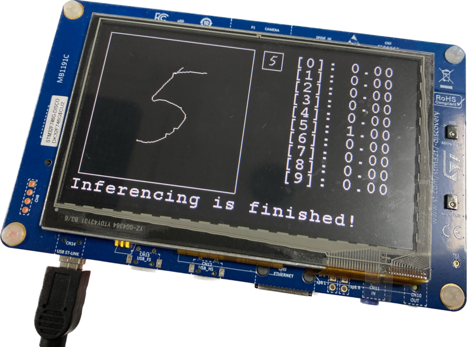

# MNIST on device



## Introduction
On-device MNIST inference example using STM32F746G-DISCO Board & Tensorflow Lite for Microcontroller(TFLM)

## Requirements
*  [STM32F746G-DISCO Board](https://www.st.com/en/evaluation-tools/32f746gdiscovery.html)
* [STM32CubeIDE](https://www.st.com/en/development-tools/stm32cubeide.html)
* X-CUBE-AI 7.3.0 (Built in this project)

## Handwriting
TODO: Write this section

## Inference Tutorial

### Project Setup
1. Create new STM32 project in STM32CubeIDE
    1. Menu [File] > [New] > [STM32 Project]
    1. Tab [Board Selector] > Find & Select 'STM32F746G-DISCO' > Button [Next]
    1. Configure your project (e.g. project name) > Button [Finish]
2. Open the `{project-name}.ioc` file > Click 'Software Packs' in [Pinout & Configuration] Tab > Click 'Select Components'
3. Find and Install STMicroelectronics.X-CUBE-AI > Select Artificial Intelligence X-CUBE-AI Core
4. Save the `{project-name}.ioc` file to generate code

### Build & Train Model
TODO: Add jupyter notebook

### TFLite Model Conversion
1. Store your keras(tensorflow) model to SavedModel using Python
```python
model = ... # Get model
model.save('/path/to/location') # ft.keras.models.save_model()
```
2. Convert SavedModel to TFLite model
```python
import tensorflow as tf

# Convert the model (path to the SavedModel directory)
converter = tf.lite.TFLiteConverter.from_saved_model('/path/to/location')
tflite_model = converter.convert()

# Save the model
with open('model.tflite', 'wb') as f:
  f.write(tflite_model)
```

### Add Model
1. Open the `{Project name}.ioc` file
2. Tab [Pinout & Configuration] > [Categories] > [Software Packs] > Select [STMicroelectronics.X-CUBE-AI]
3. Button [Add network] > Select 'TFLite' and 'TFLite Micro runtime' > Button [Browse...] > Select your TFLite model(`.tflite` file)
    * This step is essential to use TLFM
4. Button [Analyze] > [OK]
5. Save the `{project-name}.ioc` file to generate code and **convert tflite to c bytes array**
    * In `X-CUBE-AI/App/network.c` file, you can see c bytes array of tflite file

### Implement `tflm_io_write`
TODO: Write this section

### Run Inference
You can see TensorFlow for Microcontroller [Get Started](https://www.tensorflow.org/lite/microcontrollers/get_started_low_level) Reference to run inference. But there are X-CUBE-AI APIs which wrap TFLM classes and functions. It is highly compatible with STM MCU and equivalent to use TFLM library. So, I used X-CUBE-AI APIs.

**The implementation of below is in [mnist.c](./Core/Src/mnist.c) and [mnist.h](./Core/Inc/mnist.h).**

1.  Include the library & model headers
```c
#include "tflm_c.h"
#include "network_tflite_data.h"
```
* `tflm_c.h` provides TFLM class and function wrapper
* `network_tflite_data.h` provides tflite bytes array generated by X-CUBE-AI

2. Allocate memory
* We need to preallocate a certain amount of memory for input, output, and intermediate arrays. This is provided as a `uint8_t` array of size `TENSOR_ARENA_SIZE` which is determined by experimentation.
```c
#define TENSOR_ARENA_SIZE   (80 * 1024)
static uint8_t tensor_arena[TENSOR_ARENA_SIZE];
```

3. Load a model and get handler
* `tflm_c_create` in `tflm_c.cc` function executes model load, operation resolver and interpreter instantiation function in TFLM.
```c
// it will be stored X-CUBE-AI instance
// it is used for other X-CUBE-AI API(e.g. tflm_c_input, tflm_c_output)
uint32_t* hdl;

TfLiteStatus status = tflm_c_create(
    g_tflm_network_model_data, // tflite bytes array in network_tflite_data.h
    tensor_arena, // preallocated memory
    TENSOR_ARENA_SIZE, // the size of tensor_arena
    &hdl
);
```

4. Create Input Tensor
* `tflm_c_tensor_info` is used to storing tensor data(both input and output)
```c
struct tflm_c_tensor_info input_tensor;
tflm_c_input(hdl, 0, &input_tensor);

float* input = (float*)input_tensor.data;
for (int i = 0; i < TENSOR_INPUT_SIZE; i++) {
    // input processed data to input_tensor.data
    input[i] = raw_data[i] / 255.0f; // raw_data is somewhere
}
```

5. Inference
```c
tflm_c_invoke(hdl);
```

6. Create Output Tensor
* After call the `tflm_c_invoke` function, the output data has been stored somewhere. We can get data by calling the `tflm_c_output` function. Then, we can use `tflm_c_tensor_info` structure to get the output data.
```c
struct tflm_c_tensor_info output_tensor;
tflm_c_output(hdl, 0, &output_tensor);

float* output = (float*)output_tensor.data; // output[0], output[1], ..., output[9]
```

### Detail of `tflm_c_tensor_info`
```c
struct tflm_c_tensor_info {
  TfLiteType type;      // data type (e.g. float32, uint8, ...)
  int32_t  idx;         // data index
  uint32_t batch;       // axis: 0
  uint32_t height;      // axis: 1
  uint32_t width;       // axis: 2
  uint32_t depth;       // axis: 3
  uint32_t extension;   // axis: 4
  uint32_t channels;    // axis: 5
  size_t   bytes;       // tensor data size
  float    scale;
  int      zero_point;
  void*    data;        // start address of tensor data
  struct tflm_c_shape shape;
};
```